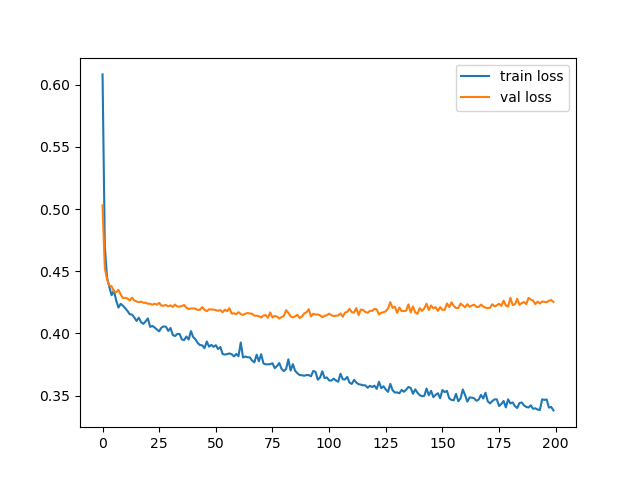

# Spaceship Titanic

This repository contains the code for Kaggle’s **Spaceship Titanic** competition. It demonstrates the complete machine learning pipeline—from data loading and cleaning to feature engineering and model training—aimed at predicting passenger survival outcomes.

## Overview

The Spaceship Titanic challenge requires predicting whether a passenger survived based on various features. Our approach includes careful data preprocessing, innovative feature extraction from the cabin information, and training a neural network for binary classification.

## Data Preparation

### Handling Missing Values

We address missing data as follows:

- **Age**: Missing values are imputed with the median age.
- **Cabin**: Instead of discarding missing values, we retain them since the test data also has missing entries. We hypothesize that the presence or absence of cabin information is informative.
- **Spending Features**: For the five expenditure indicators (`SPA`, `ShoppingMall`, `FoodCourt`, `RoomService`, `VRDeck`), as well as for features related to refrigerated dormancy and VIP services, missing values are filled with 0. This reflects the assumption that most passengers do not incur additional expenses.
- **HomePlanet & Destination**: Missing values in these features (which appear in both training and test sets) are filled with 0.

### Feature Engineering: Cabin Details

Cabin information is split into three separate features:
- **Deck**
- **Room**
- **Side**

We believe that these details (especially the cabin location) may correlate with survival likelihood. For missing cabin entries, we assign a placeholder tuple `(-1, -1, -1)` to highlight their absence.

After feature extraction, we normalize the features before training.

## Model Training

We build a simple fully-connected neural network for binary classification. Below is the model architecture implemented using PyTorch:

```python
import torch.nn as nn

class BinaryClassification(nn.Module):
    def __init__(self, input_dim=12):
        super(BinaryClassification, self).__init__()
        self.net = nn.Sequential(
            nn.Linear(input_dim, 32),
            nn.ReLU(),
            nn.Linear(32, 16),
            nn.ReLU(),
            nn.Linear(16, 1)
        )

    def forward(self, x):
        return self.net(x)

```

### Training Parameters

| Parameter           | Value   |
|---------------------|---------|
| Train-Test Split    | 0.7     |
| Batch Size          | 64      |
| Learning Rate       | 0.001   |
| Number of Epochs    | 200     |
| Number of Features  | 13      |

*Note: Although the above table shows training for 200 epochs, our final training run was conducted for 800 epochs using the Adam optimizer with `BCEWithLogitsLoss` as the loss function. This achieved a validation accuracy of approximately **0.794**.*

### Loss Function Visualization

Below is an example visualization of the loss function during training:



## Changelog

- Feb 2, 2025: Initial commit. Completed basic data cleaning and established a neural network training workflow, supporting a full pipeline from data loading to prediction and inference.

## To-Do

- [ ] Develop a more robust neural network architecture and optimize hyperparameters.
- [ ] Apply PCA to reduce the dimensionality of the data and evaluate its effectiveness.
- [ ] Explore and discuss improved strategies for handling NaN values in the `HomePlanet` and `Destination` columns.
- [ ] Tuning Learning Rate


## License

This project is licensed under the MIT License - see the [LICENSE](LICENSE) file for details.
